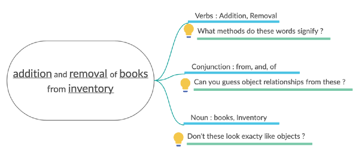

# Lập Trình Hướng Đối Tượng

**Thuật toán + Cấu trúc dữ liệu = Chương trình**

Có một cuốn sách nổi tiếng của Niklaus Wirth, bao gồm các khái niệm cơ bản về lập trình, và Mohan đã đọc rất kỹ.

"Tôi biết mọi thứ về cách viết một chương trình; tại sao tôi cần học OOPS?"

Mohan khoe khoang.

"Bởi vì những gì Niklaus nói về mặt lý thuyết là đúng, một chương trình thực sự là sự kết hợp của hai thứ, thông tin (Dữ liệu) và một tập hợp các hướng dẫn để thao tác thông tin đó (Thuật toán). Nhưng hóa ra chúng ta không chỉ viết chương trình, chúng ta còn viết phần mềm. ”~ Nhà phát triển khôn ngoan trả lời.

"Chà, có gì khác nhau?" - Mohan hỏi, vẫn chưa hiểu rõ về sự khác biệt. Một chương trình được viết để thực hiện một tác vụ cụ thể, chẳng hạn như sắp xếp danh sách được liên kết hoặc tìm đường dẫn tối thiểu trong cây hoặc đơn giản là hiển thị thông báo 'hello world' trên bảng điều khiển của bạn. Nhưng phần mềm là một tập hợp các chương trình tương tác với nhau để thực hiện một hoặc nhiều
các nhiệm vụ.

Phần mềm hiện đại thường bao gồm hàng triệu dòng mã và hoạt động trên hàng terabyte dữ liệu, và phức tạp đến mức không một người nào hiểu hết được. Do đó, chúng tôi cần một cách để tổ chức các hướng dẫn này sao cho:
- Dễ dàng hiểu và giải thích hơn.
- Dễ dàng sử dụng lại và mở rộng.
- Dễ bảo trì hơn

"Lập trình hướng đối tượng (OOP) là một trong những mô hình phổ biến nhất được sử dụng trong vài thập kỷ qua cho mục đích này." ~ Nhà phát triển khôn ngoan trả lời.

“Vậy OOP là gì và nó có thể giúp gì cho tôi?” - Mohan lúc này mới tò mò muốn biết thêm.

Trước đó, chúng ta hãy hiểu đối tượng là gì? Đối tượng là một cấu trúc logic bao gồm một số dữ liệu do người dùng định nghĩa và một tập hợp các thao tác để thao tác với dữ liệu đó.

**Dữ liệu + Hoạt động = Đối tượng**

Và Lập trình hướng đối tượng là (như tên gọi!) Là một cách để suy nghĩ và cấu trúc chương trình của bạn xung quanh các đối tượng này. Ý tưởng cốt lõi là: Suy nghĩ theo hướng đối tượng là một cách tuyệt vời để hiểu vấn đề bạn đang cố gắng giải quyết. Nó cho phép bạn xây dựng phần mềm dễ bảo trì hơn và dễ hiểu đối với người khác.

**Hệ thống xây dựng: Cách 'OOP'**

Ví dụ: giả sử bạn muốn xây dựng hệ thống quản lý hàng tồn kho cho một hiệu sách. Và các yêu cầu là:
1. Hệ thống phải cho phép lưu trữ siêu dữ liệu của từng cuốn sách, như tên, tác giả, giá, v.v.
2. Hệ thống sẽ cho phép thêm và xóa sách khỏi kho.
3. Hệ thống phải có khả năng tìm kiếm sách bằng siêu dữ liệu.
Để xây dựng hệ thống của bạn theo 'Hướng đối tượng', bạn sẽ phải



1. Xác định các đối tượng trong hệ thống của bạn.
💡 'Danh từ' trong yêu cầu của bạn thường dịch thành 'Đối tượng' trong hệ thống của bạn. Hãy thử một lần!
2. Xác định các mối quan hệ và trách nhiệm của các đối tượng này.
💡 Việc xác định các động từ trong yêu cầu của bạn giúp bạn có một ý tưởng tuyệt vời về vai trò và trách nhiệm của từng đối tượng.
3. Xác định các thuộc tính (dữ liệu) và các thao tác (phương thức) cho từng đối tượng.
💡 Tương tự như bài tập trước, hãy nhìn lại các danh từ, tính từ và động từ còn lại. Các tính từ xác định các thuộc tính và các động từ xác định các hoạt động được thực hiện trên đối tượng.

Viết ra phân tích của bạn, lặp lại các bước và sử dụng một số nhận thức thông thường để tinh chỉnh thêm thiết kế của bạn. Đặt những câu hỏi như: Tác giả cần phải là một lớp hoặc chuỗi? Tôi nên bảo quản sách như thế nào để có thể tra cứu dễ dàng? Thứ tự của kết quả tìm kiếm có quan trọng không? Điều gì xảy ra nếu người dùng muốn sắp xếp sách theo giá? Đặt những câu hỏi như vậy sẽ giúp bạn:
- Hiểu đối tượng nào bạn làm hoặc không cần.
- Tránh lỗi trong hệ thống của bạn.
- Cung cấp phần mềm thực hiện những gì người dùng cần.

Đây là một ví dụ đơn giản về cách các lớp của bạn có thể trông như thế nào:

```java
class Book {
    string name;
    string authorName;
    float price;
    string getName() { return this.name; }
    void setName(string name) { this.name = name; }
    string getAuthorName() { return this.authorName; }
    void setAuthorName(string authorName) { this.author = author; }
    float getPrice() { return this.price; }
    void setPrice(float price) { this.price = price; }
}

class Inventory {
    Book [] bookList;
    Book [] searchItem(string name) {}
    void addItem(Book book) {}
    Book removeItem(Book book) {}
}
```

