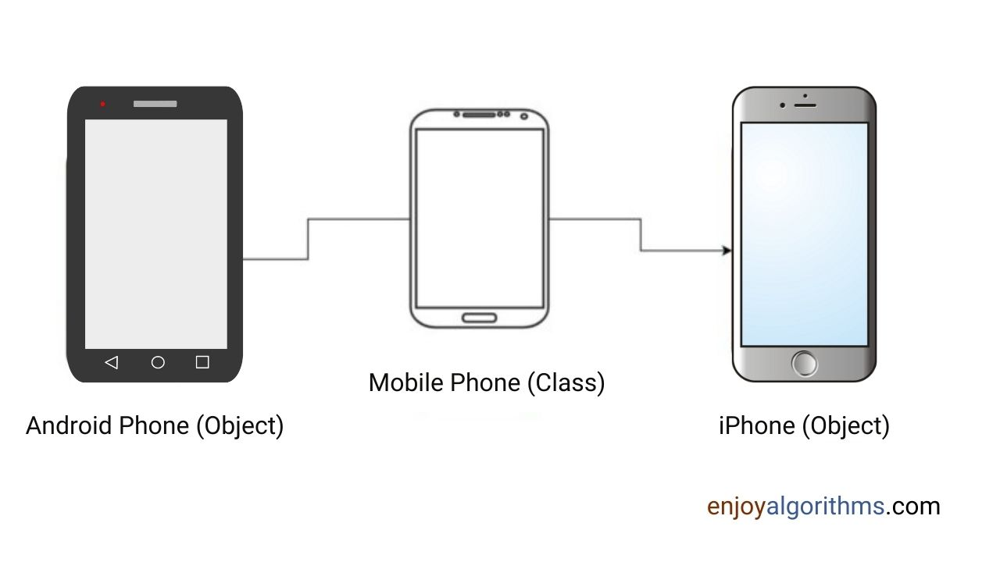
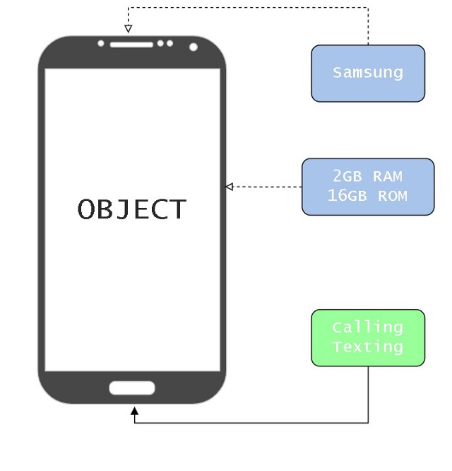
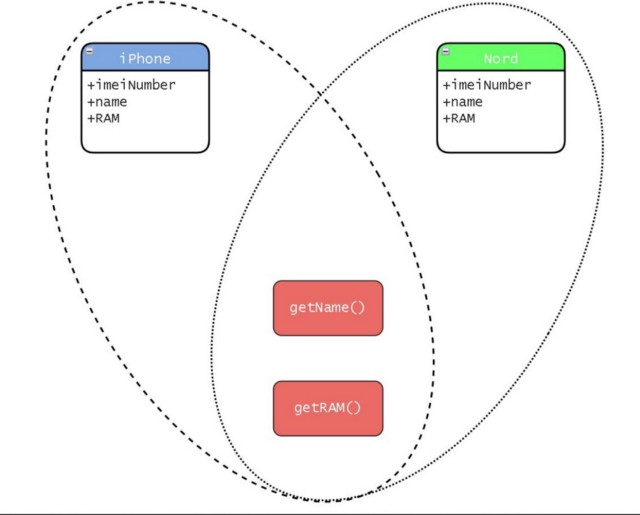

# Lớp và Đối tượng trong Lập Trình Hướng Đối Tượng (OOP)



Để giải quyết các vấn đề trong thế giới thực bằng cách sử dụng phần mềm, ta sẽ cần xác định cấu trúc của thế giới thực với các thuộc tính để biểu hiện các đặc trưng của cấu trúc. Thế nên ở đây, **lớp (class)** và **đối tượng (object)** xuất hiện trong bức tranh oop để thực hiện nhiệm vụ này. Hiểu đơn giản thì, các lóp và đối tượng là các thành phần chức năng cho xây dựng theo thiết kế hướng đối tượng, nó giúp chúng ta triển khai các khái niệm quan trọng trong OOPS. 

## Lớp là gì ?

Một lớp là một cấu trúc do người dùng định nghĩa đồng thời cũng là một bản thiết kế chung (blueprint) cho các đối tượng để mô tả cụ thể rằng đối tượng sẽ trông như thế nào. Một lớp bao gồm hai thành phần:
- Thuộc tính hay các biến thành viên
- Triển khai hành vi hay các hàm thành viên

Trong hướng đối tượng, thuật ngữ **lớp** đề cập đến một bản thiết kế xác định các biến và phương thức chung cho tất cả các đối tượng cùng nhóm. Nó giúp chúng ta truyền dữ liệu và phương thức cùng nhau, đảm bảo khả năng tái sử dụng code khác với lập trình hướng thủ tục (procedural language).

Ví dụ, một điên thoại di dộng có các thuộc tính như tên hãng, RAM và các chức năng như nhắn tin và gọi điện. Do đó, điện thoại di động là một lớp cho các kiểu điện thoạt (đối tượng) khác nhau. Một lớp `MobilePhone` có thể được định nghĩa như sau:

```java
public class MobilePhone {
    // attributes
    private String imeiNumber;
    public String name;
    public int RAM;

    // methods
    public String getName() {
        return name;
    }
    public int getRam() {
        return RAM;
    }
}
```

## Đối tượng là gì?

Một đối tượng là một thực thể duy nhất của lớp, nó bao gồm dữ liệu và các phương thức sẽ hoạt động với dữ liệu đó. Do đó một đối tượng bao gồm 3 thành phần:
- Tên: là tên biến dùng để biểu diễn đối tượng.
- Dữ liệu thành viên: dữ liệu để mô tả đối tượng.
- Phương thức thành viên: mô tả hành vi của đối tượng.

Ví dụ, Samsung Galaxy là một đối tượng với tên hãng là Samsung, 2GB RAM là thuộc tính, và các hành vi như gọi điện và nhắn tin.



#### Lưu ý

- Khi định nghĩa một lớp, sẽ không có bộ nhớ nào được cấp phát, bộ nhớ chỉ cấp phát khi tạo đối tượng.


## Các thành phần trong lớp

- **Access modifier:** một lớp có thể là công khai bằng cách thêm từ khoá `public` trước tên của nó. Một lớp công khai có thể truy cập bởi bất kỳ lớp hay hàm nào, trong khi đó một lớp mặc định chỉ có thể truy cập trong cùng đoạn code đấy.
- Từ khoá `class` được thêm trước tên lớp như một định danh hợp lệ cho các khai báo lớp.
- Thân lớp bao gồm các thuộc tính còn được gọi là **instance variables** và các phương thức (hàm) của lớp.
- Mỗi phương thức/thuộc tính có thể được chỉ định truy cập bằng các từ khoá như `private`, `protected` hoặc `public`.

*Thuộc tính có thể là bất kỳ kiểu dữ liệu nào dù là kiểu dữ liệu người dùng định nghĩa hay các kiểu nguyên thuỷ.

**Khai báo lớp (class declaration)**: một khai báo lớp biểu diễn một đối tượng sẽ trông như thế nào và các hàm khả dụng của nó. Nó cung cấp một interface cho người dùng, để họ có thể sử dụng lớp cho tạo các đối tượng và gọi các phương thức cần thiết cho các đối tượng đó.

**Định nghĩa lớp (class defination)**: đây là triển khai chi tiết của lớp, nó bao gồm các định nghĩa cho các thành viên của nó. Người dùng không thể thấy được điều ày.

## Khai báo đối tượng

Ở đây cú pháp khai báo đối tượng tương tự như khai báo các biến thông thường. Vì dù sao một lớp cũng là một kiểu dữ liệu người dùng định nghĩa, nên ta có thể tạo các biến lưu trữ các đối tượng như sau:

```
MobilePhone iPhone;
MobilePhone Nord;
```

Trong Java, các biến trỏ đến hoặc giữ các đối tượng được gọi là **biến tham chiếu (reference variables)**. Hai biến `iPhone` và `Nord` hiện đang giữ giá trị **null**. Để lữu trữ các giá trị thực, ta cần khởi tạo nó cùng với các đối tượng.

### Khởi tạo và sử dụng đối tượng

Để khởi tạo đối tượng, ta thường dùng toán tử `new`.

```java
iPhone = new MobilePhone();
Nord = new MobilePhone();
```

Trong đoạn code trên, `MobilePhone()` đề cập đến constructor của lớp `MobilePhone`. Một constructor là một phương thức đặc biệt sẽ được chạy ngay khi ta khởi tạo đối tượng. Trong Java, toán tử **new** cấp phát bộ nhớ từ heap cho đối tượng mới và trả về một tham chiếu đến vùng nhớ này.

Mỗi thực thể của một lớp sẽ có một tập các biến của riêng nó. Nhưng tất cả sẽ có cùng một tham chiếu đến một tập các phương thức dùng chung được khai báo trong lớp. Minh hoạ cho điều này như sau:



Ta có thể truy cập các thuộc tính và phương thức khác nhau của đối tưởng bằng cách sử dụng toán tử `.`. Ví dụ để lấy hàm `getName()` của iPhone, ta viết `iPhone.getName()`

## Sự quan trọng của các chỉ định truy cập

Giả sử ta có thao tác:

```java
System.out.println(iPhone.imeNumber)
```

Thao tác này là không hợp lệ vì `imeiNumber` là thuộc tính riêng tư. Bằng định nghĩa này, bất kỳ đối tượng nào cũng không thể truy cập vào cac dữ liệu thành viên là private hay protected. Nói cách khác, các lớp sẽ triển khai data-hiding bằng cách khai báo dữ liệu thành viên là p

## Các trường hợp sử dụng lớp và đối tượng trong OOPS

- Với lớp và đối tượng ta có thể thực hiện kế thừa và data-hiding.
- Đóng gói gữ liệu và các thao tác liên quan thành một đơn vị duy nhất. Các lớp giúp đóng gói trạng thái và hành vi.
- Thực hiện việc ẩn các triển khai chi tiết của ứng dụng với thể giới bên ngoài và chỉ cung cấp các chi tiết tiêu biểu. Trong Java ta có thể triển khai trừu tường bằng các lớp trừu tượng và interface.

