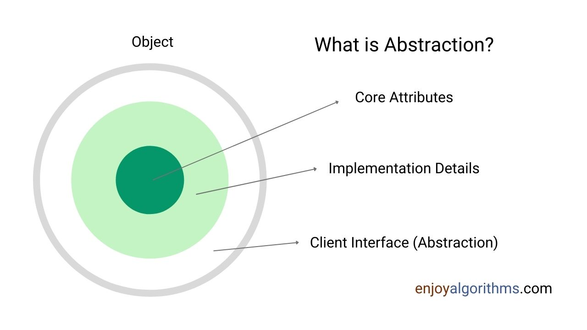
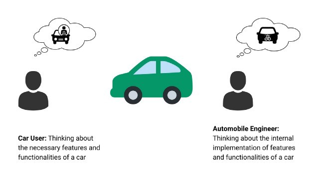

# Tính Trừu Tượng Trong Lập Trình Hướng Đối Tượng (OOPS)

## Tính trừu tượng trong thế giới thực ?

Theo thuật ngữ triết học, **trừu tượng** là khái quát hoá ra trong tư duy từ các thuộc tính hay hành vi của một đối tượng. Ví dụ, tư duy của chúng ta hoạt động dựa trên sự trừu tượng. Khi ta nghĩ về một chiếc xe, hầu hết chúng ta sẽ nhớ về một khái niệm trừu tượng của một chiếc xe và các chức năng của nó. Đó là lý do tại sao ta có thể nhận ra một đối tượng là một chiếc xe, ngay cả nó khhi khác với các chiếc xe mà ta từng thấy trước đó. Nói cách khác, ta phát triển các khái niệm hằng ngày bằng quá trình trừu tượng hoá. Trong đó ta loại bỏ các chi tiết không cần thiết và tập trung vào các thuộc tính và chức năng thiết yếu.

Tính trừu tượng có mặt trong hầu hết các ứng dụng thực. Ví dụ:
- Khi chúng ta đăng nhập vào một số tài khoản trực tuyến, ta nhập id người dùng và mật khẩu. Sau khi click vào nút đăng nhập: cách dữ liệu đầu vào được gửi đến máy chủ và được xác minh đều được trừu tượng.
- Khi chúng ta gõ trên máy tính của mình, chúng ta nhấn các phím để nhận kết quả trên màn hình. Chúng ta không biết gì về cơ chế tạo ra đầu ra.
- Trong Java, HashMap cung cấp các phương thức để lưu trữ và truy xuất các cặp key-value từ map. Vì vậy, chỉ có thông tin chúng ta cần để sử dụng hash map là xác định trường hợp sử dụng của nó trong ứng dụng của chúng ta. Làm thế nào nó được thực hiện bên trong, chúng ta không cần phải biết nó.
- Giả sử chúng ta đang thiết kế một lớp để tương tác với cơ sở dữ liệu để thực hiện một số hoạt động với cơ sở dữ liệu. Bây giờ một client của lớp chúng ta không cần phải biết về lập trình cơ sở dữ liệu. Chúng chỉ cần biết một số chi tiết của lớp để thực hiện các hoạt động cơ sở dữ liệu mà không cần kiến thức sâu về lập trình cơ sở dữ liệu.

## Tính trừu tượng trong lập trình hướng đối tượng ?

Trong OOPS, tính trừu tượng thể hiện chức năng cần thiết cho các đối tượng bên ngoài và ẩn các chi tiết triển khai. Điều này giúp các lập trình viên sử dụng logic phức tạp bên trong một đối tượng mà không cần hiểu cách thực hiện của nó. Nói cách khác, đó là quá trình ẩn các chi tiết bên trong của một ứng dụng khỏi thế giới bên ngoài để chúng ta chỉ cần biết code làm gì chứ không cần biết nó hoạt động như thế nào.

### Ý tưởng cốt lõi

- Một đối tượng chứa một số thuộc tính và phương thức. Sử dụng access modifier, chúng ta có thể ẩn các chi tiết cần thiết và cung cấp quyền truy cập vào các phương thức và thuộc tính cần thiết cho thế giới bên ngoài. Đây là một trong những thủ tục chung để đạt được sự trừu tượng trong OOPS.
- Tính trừu tượng liên quan đến việc xác định các đối tượng như những "tác nhân" trừu tượng có thể thực hiện một số bộ chức năng, thay đổi trạng thái của chúng và giao tiếp với các đối tượng khác.
- Chúng ta cũng có thể hiểu trừu tượng bằng cách sử dụng kế thừa. Trong hệ thống phân cấp kế thừa, các lớp cha chứa triển khai chung, nhưng các lớp con bao gồm triển khai chi tiết hơn của các lớp cha.
- Tính trừu tượng là ý tưởng cốt lõi đằng sau nhiều nguyên tắc cơ bản như Open/Closed Principle và Dependency Inversion Principle.

## Các kiểu trừu tượng trong OOPS

Ở đây có hai kiểu trừu tượng trong OOPS là trừu tượng dữ liệu và trừu tượng điều khiển.

### Trừu tượng dữ liệu

Trừu tượng hóa dữ liệu là sự phân tách rõ ràng giữa các thuộc tính của một kiểu dữ liệu và các chi tiết cụ thể của việc triển khai nó. Để thực hiện được điều này, chúng ta có thể tạo các kiểu dữ liệu trong một lớp, thiết kế các hoạt động để làm việc với kiểu dữ liệu và ẩn tất cả các chi tiết triển khai khỏi thế giới bên ngoài. Nói cách khác, khi dữ liệu của một đối tượng không khả dụng với thế giới bên ngoài, nó sẽ tạo ra sự trừu tượng hóa dữ liệu. Nếu được yêu cầu, chúng ta có thể cung cấp quyền truy cập vào dữ liệu của đối tượng thông qua một số phương pháp.

Nói cách khác, trừu tượng hóa dữ liệu cung cấp một interface cho kiểu dữ liệu mà phía client có thể nhìn thấy để sử dụng nó. Đồng thời, bên trong lớp, chúng ta có thể giữ các hoạt động làm việc trên dữ liệu đó hoàn toàn riêng tư, chúng ta có thể thay đổi sau để cập nhật thêm hoặc cải thiện hiệu quả. Ý tưởng là bất kỳ thay đổi nào như vậy trong việc triển khai cụ thể đều không ảnh hưởng đến client code.

Ví dụ, người ta có thể định nghĩa một kiểu dữ liệu trừu tượng được gọi là `Dictionary`, trong đó mỗi khóa được liên kết với một giá trị duy nhất và chúng ta có thể truy cập các giá trị dựa trên các khóa của chúng. Cấu trúc dữ liệu như vậy có thể được triển khai bằng cách sử dụng bảng băm, cây tìm kiếm nhị phân hoặc thậm chí là một mảng đơn giản. Đối với client code, loại thuộc tính trừu tượng là giống nhau trong mỗi trường hợp.

### Trừu tượng điều khiển

Trừu tượng hóa điều khiển là sự trừu tượng hóa của các hành động. Thông thường, chúng ta không cần cung cấp chi tiết về tất cả các phương thức của một đối tượng. Nói cách khác, khi chúng ta ẩn việc triển khai nội bộ của các phương pháp khác nhau liên quan đến hoạt động của client, nó sẽ tạo ra sự trừu tượng hóa điều khiển.

Chúng ta cũng có thể hiểu nó theo cách khác ở cấp độ thấp. Code phần mềm là một tập hợp các phương thức được viết bằng ngôn ngữ lập trình. Hầu hết thời gian, một số phương pháp tương tự và lặp lại nhiều lần. Vì vậy, ý tưởng của trừu tượng hóa điều khiển là xác định tất cả các phương pháp như vậy và đóng gói chúng thành một đơn vị duy nhất.

- Trừu tượng điều khiển tuân theo nguyên tắc DRY, có nghĩa là **Không lặp lại chính mình** và sử dụng các phương pháp trong một chương trình.
- Sử dụng trừu tượng hóa điều khiển, chúng ta có thể xây dựng các chức năng mới và kết hợp các câu lệnh điều khiển thành một đơn vị duy nhất.
- Chúng ta nhấn mạnh nhiều hơn về cách có thể đạt được một chức năng cụ thể hơn là mô tả từng chi tiết.

*Lưu ý*: Trừu tượng điều khiển là một trong những mục đích chính của việc sử dụng ngôn ngữ lập trình. Máy tính hiểu các hoạt động ở mức rất thấp, chẳng hạn như di chuyển một số bit từ vị trí bộ nhớ này sang vị trí khác và tạo ra tổng của hai chuỗi bit. Các ngôn ngữ lập trình cho phép thực hiện điều này ở cấp độ cao hơn.

## So sánh tính trừu tượng và tính đóng gói

Một thiết kế code tốt với việc sử dụng tính trừu tượng một cách hợp lý tuân theo nguyên tắc **Principle of Least Astonishment**: "Một thành phần của hệ thống phải hoạt động theo cách mà hầu hết người dùng sẽ mong đợi nó hoạt động. Hành vi của nó không được làm người dùng ngạc nhiên".

Nhưng câu hỏi quan trọng là: "Làm thế nào để xác định và phơi bày hành vi mong đợi đó cho người dùng ? Làm thế nào để xử lý các chi tiết triển khai của chúng ? Ở giai đoạn này, một trụ cột của oops cũng xuất hiện: Tính đóng gói

Sự khác biệt cơ bản của tính trừu tượng và tính đóng gói:

| Trừu tượng | Đóng gói |
|-|-|
| Trừu tượng tập trung đến những hành vi có thể quan sát được của đối tượng | Đóng gói tập trung vào việc triển khai để tạo nên các hành vi này |
| Sử dụng trừu tượng ta giải quyết các vấn đề ở cấp độ thiết kế | Sử dụng đóng gói ta giải quyết các vấn đề ở cấp độ triển khai |
| Trừu tượng là phương thức ẩn đi các thông tin không mong muốn | Đóng gói là phương thức ẩn đi dữ liệu trên một thực thể duy nhất và bảo vệ thông tin khỏi bên ngoài |

## Ưu điểm của tính trừu tượng

