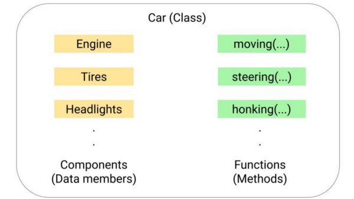

# Tính đóng gói trong lập trình hướng đối tượng (OOPS)

## Tính đóng gói trong OOPS là gì?

Tính đóng gói là một trong những khái niệm cốt lõi của OOP nó đóng gói dữ liệu và các phương thức liên quan thực hiện trên dữ liệu đó thành một khối duy nhất gọi là **lớp (class)**. Nó còn dùng cho các ràng buộc truy cập trực tiếp đến các dữ liệu và phương thức liên quan với lớp (data hiding). Nói cách khác: Đóng gói là bọc dữ liệu và phương thức thành một lớp duy nhất và bảo vệ nó khỏi các can thiệp từ bên ngoài.

Trong quyển sách nổi tiếng *Object-Oriented Analysis and Design*, Grady Booch có viết

> Đóng gói là quá trình ngăn cách các phần tử của một sự trừu tượng để cấu thành các cấu trúc và hành vi của nó; đóng gói cung cấp một interface tách biệt cho sự trừu tượng và triển khai của nó.

Định nghĩa này không thực sự 