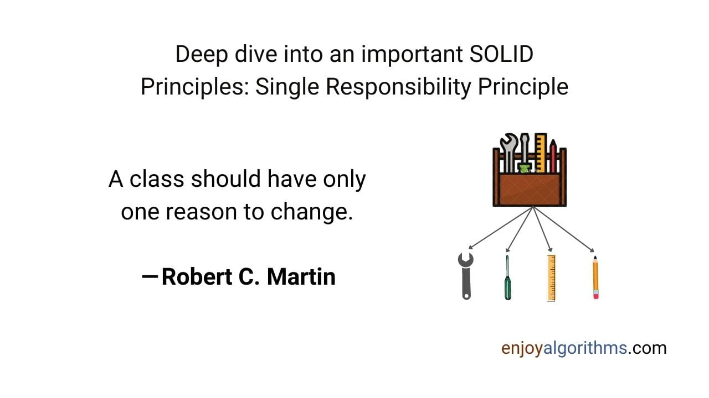

# Nguyên Tắc SOLID thứ nhất : Single Responsibility Principle (RCP)

## Câu chuyện

Mohan đang ngồi ở trong phòng của anh ấy và đợi nhiệm vụ tiếp theo được giao sau khi thăng chức. Rahul đã sớm đến văn phòng của anh ấy.

- Rahul: Chúc mừng được thăng chức, Mohan!
- Mohan: Cảm ơn, Rahul.
- Rahul: Như bạn đã biết, nhóm ở bên Mỹ sẽ chuyển cho 